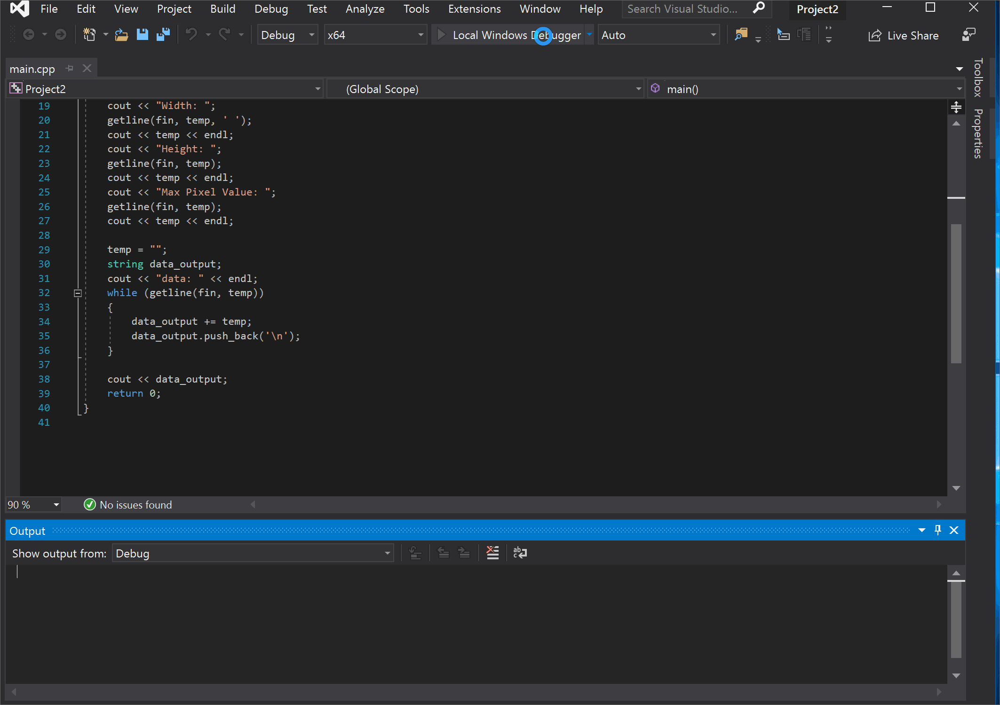

## Reflection Pa2

The best part of this assignment was recalling and re-researching all of the things I forgot over the past few months. It all came back quickly but was still a bit troublesome. Using getline and file IO again, was fun and somewhat relaxing for me. 

The assignment itself wasn’t all that difficult. The most important thing a student can remember about coding for this assignment, would be to use their resources. (I.E. stack exchange, google, etc.) knowing how to use getline to read a full file would also be useful. 

The assignment was a little short, especially for something that we had over a week to do. I was able to finish it within the lab period alone. Maybe lengthening it a bit, adding one or two more aspects to the assignment. Adjusting the due date to be sooner might also work. This would have the added benefit of giving us more time on the next assignment. 

I had some trouble with using visual studio. I didn't know that I had to use to solution files to see and use my code properly within visual studio. I spent about 20 or so minutes trying to solve this issue. I wasn't that big of a deal, but it did leave me a bit frustrated. Though I'm pretty sure I won't forget to use solution files in the future. For future students: visual studio gets easier with time. It took me about 3 weeks to get any sembalnce of familiarity with it, so don't feel discouraged if things aren't running smoothly for you at first. This goes both for visual studio and cs112. 

## Program's .gif
Here is my walkthrough of the code:

